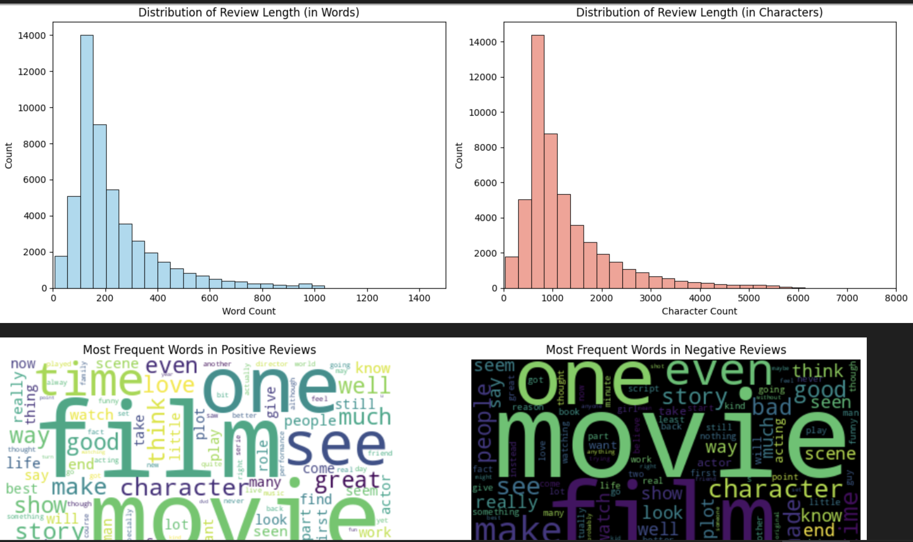
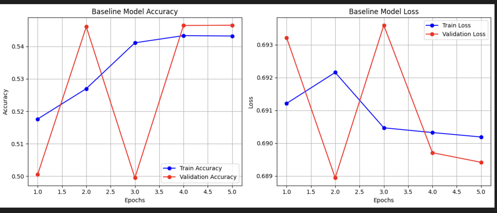
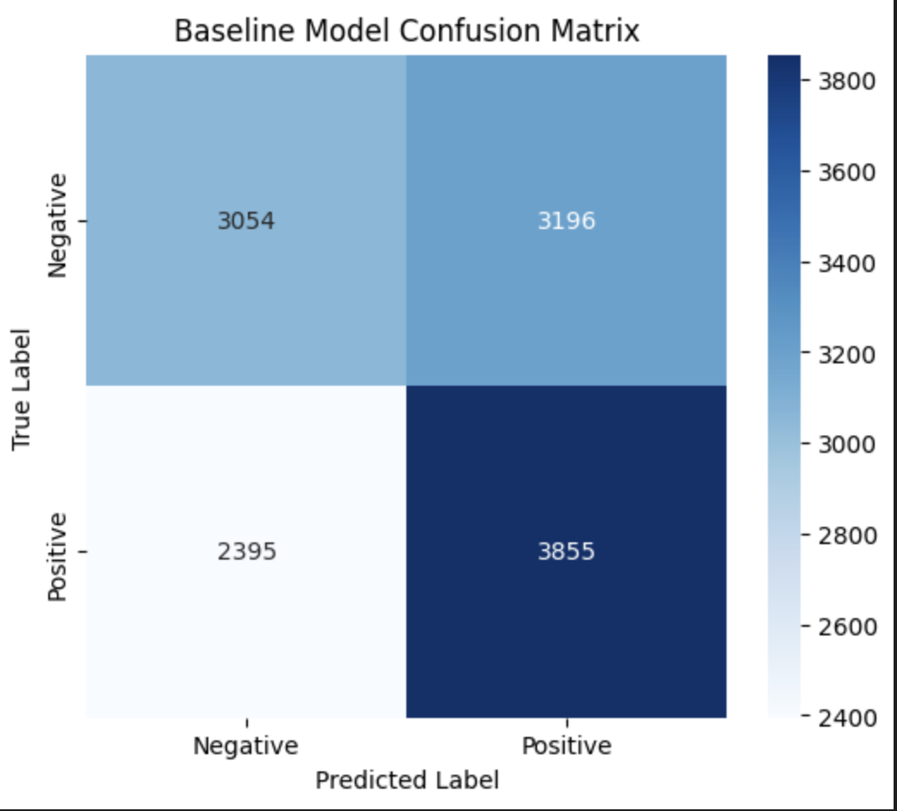
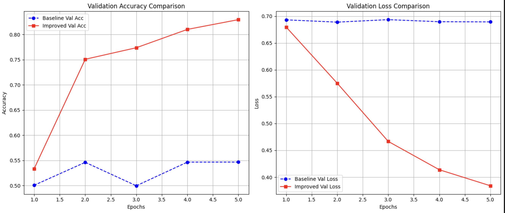
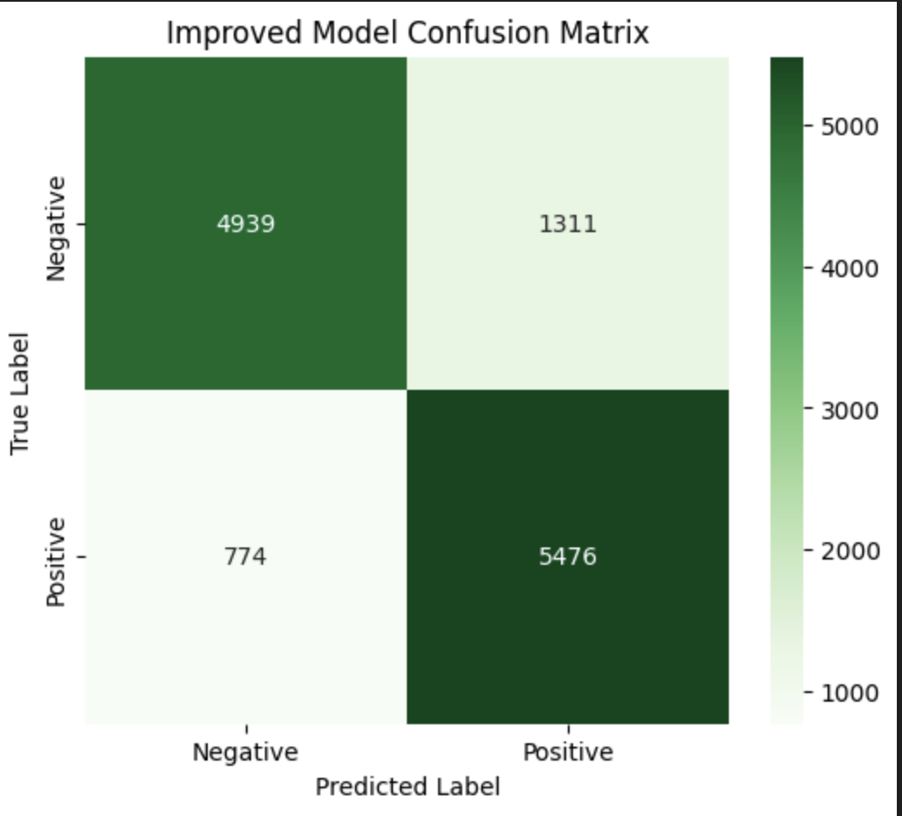

# Deep Sentiment Analysis: A Comparative Study of LSTM and GRU Models


This project provides a comprehensive exploration of Recurrent Neural Networks (RNNs) for sentiment analysis. It details the end-to-end process of building, training, and evaluating two different architectures—a baseline LSTM and an improved bidirectional GRU—on a large-scale movie review dataset. The entire pipeline is implemented in PyTorch, with a focus on demonstrating the performance impact of architectural choices in sequence modeling.

---

## 📊 Dataset & Exploratory Data Analysis

The project utilizes a large dataset of 1.6 million movie reviews, each labeled with either positive or negative sentiment. An initial exploratory data analysis (EDA) was performed to understand the data's characteristics and inform the preprocessing and modeling strategy.

* **Review Length Distribution**: Histograms of review lengths reveal a right-skewed distribution, with most reviews being under 200 words. This guided the decision for padding and truncating sequences to a uniform length.
* **Word Frequencies**: Word clouds for positive and negative reviews visualize the most common terms associated with each sentiment. This analysis helps in understanding the lexical features that might distinguish between classes.



---

## 🧠 Model Architectures

Two distinct recurrent neural network models were built and compared to evaluate their effectiveness on the sentiment classification task.

### 1. Baseline Model: LSTM
The first model is a standard **Long Short-Term Memory (LSTM)** network, chosen for its ability to handle long-term dependencies in sequential data.
* **Architecture**: It consists of an `nn.Embedding` layer, three stacked `nn.LSTM` layers with `Dropout` for regularization, and a final `nn.Linear` layer for classification.

### 2. Improved Model: Bidirectional GRU
The improved model replaces the LSTM layers with **Gated Recurrent Units (GRUs)** and makes them **bidirectional** to enhance context understanding.
* **Architecture**: This model uses stacked `nn.GRU` layers with `bidirectional=True`, allowing the network to process text from both directions. The final hidden states from both directions are concatenated before being passed to the classifier, providing a richer representation of the sequence.

---

## 🏆 Performance and Quantitative Results

Both models were trained for 5 epochs and evaluated on a held-out test set. The results clearly demonstrate the significant performance improvement of the bidirectional GRU architecture.

### Baseline LSTM Performance
The baseline model's training was unstable, as shown by the fluctuating validation accuracy and loss curves. The model struggled to generalize effectively from the training data.



**Quantitative Test Results (Baseline):**
* **Final Test Accuracy**: **54.8%**
* **Confusion Matrix Analysis**:
    * **True Negatives**: 3,054
    * **False Positives**: 3,196
    * **False Negatives**: 2,395
    * **True Positives**: 3,855
    * The matrix shows the model is only slightly better than random chance, misclassifying a large number of both positive and negative reviews.



### Improved GRU Performance & Comparison
The improved bidirectional GRU model achieved substantially better and more stable results. The validation accuracy consistently increased while the validation loss steadily decreased, indicating effective learning.



**Quantitative Test Results (Improved Model):**
* **Final Test Accuracy**: **82.2%**
* **Confusion Matrix Analysis**:
    * **True Negatives**: 4,939
    * **False Positives**: 1,311
    * **False Negatives**: 774
    * **True Positives**: 5,476
    * This matrix demonstrates a significant improvement, with the model correctly identifying a large majority of both positive and negative reviews and making far fewer errors than the baseline.



### Conclusion
The architectural shift from a standard LSTM to a **bidirectional GRU** was the key factor in the **27.4%** increase in test accuracy. The ability to process text from both directions allowed the GRU model to capture a richer contextual understanding, leading to a much more accurate and robust sentiment classifier.

---

## 🚀 How to Run

1.  **Prerequisites**: Ensure you have Python and the necessary libraries installed.
    ```bash
    pip install torch torchtext scikit-learn pandas matplotlib seaborn nltk wordcloud
    ```
2.  **Dataset**: Download the `training.1600000.processed.noemoticon.csv` file and place it in the same directory as the project notebook.
3.  **Execution**: Open and run the cells in the `a2-part1-ritwijar-apurvago.ipynb` Jupyter Notebook sequentially.## Final Results
